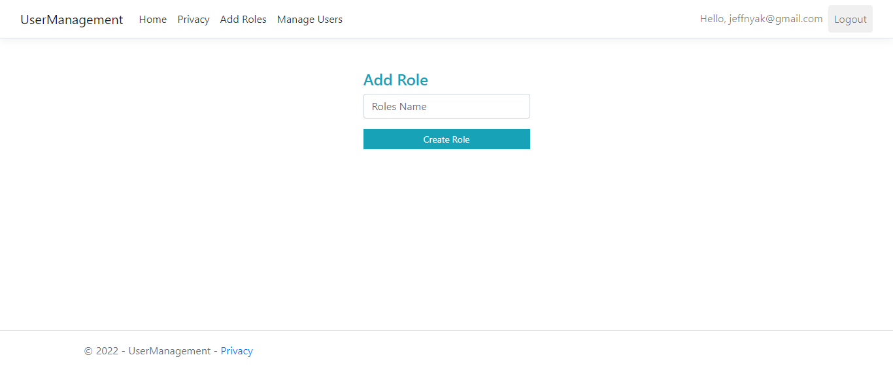
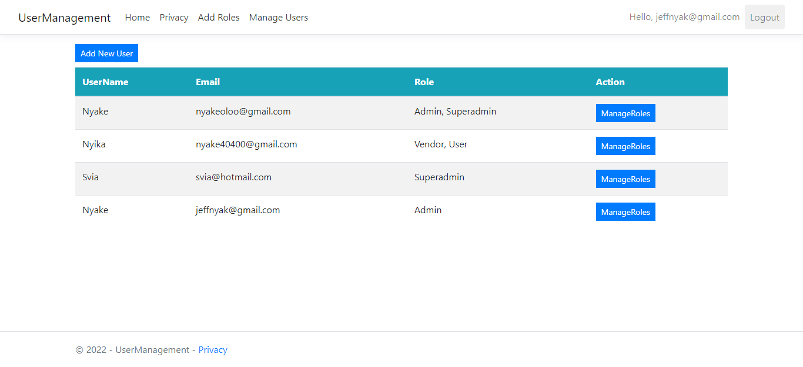
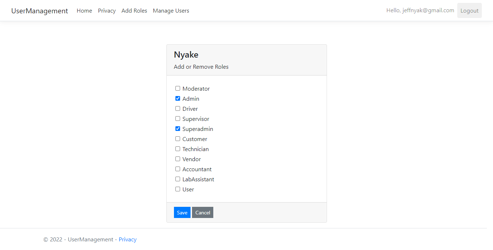
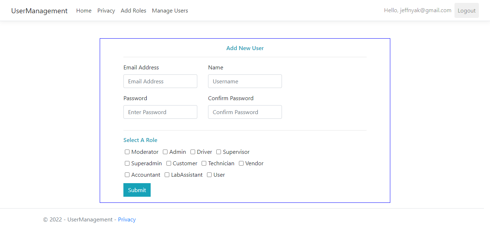
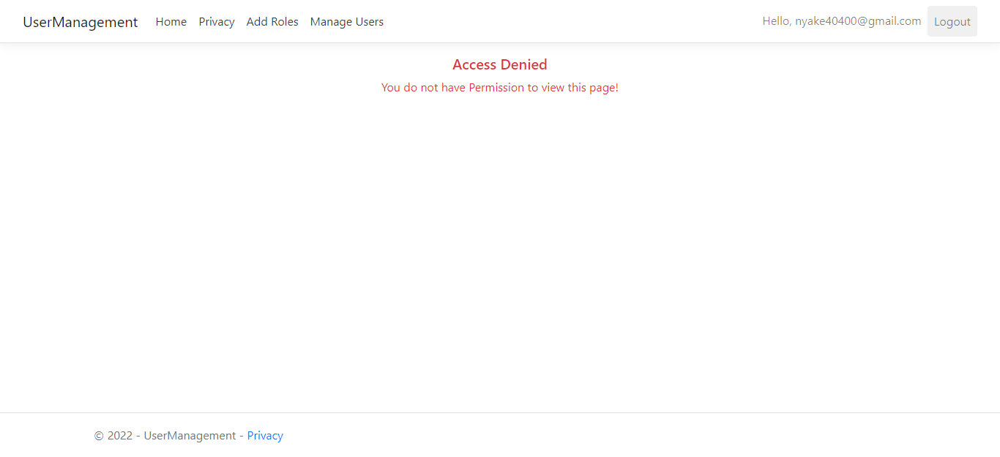

UserManagement Management System using AspNetCore Mvc, .NET 6 and SqlServer.

### The app covers the following areas and functionalities:
   
   1. User registration with Email Confirmation link.
   2. Forgot and Reset password via Email.
   3. User register with a default role.
   4. Login functionality using Email and Password.
   5. Create roles by the Admin or SuperAdmin.
   6. Create User and assign role.
   7. Manage Roles.
   8. User lockout functionality..

### NB: Claims based authorization will depend on the scope and requirements of your application.
       The Same applies to Two factor and external authentication.
       Edit User can be implemented later..feel free todo so.

### Below is a sample screenshot:

Happy Coding and Cheers.

